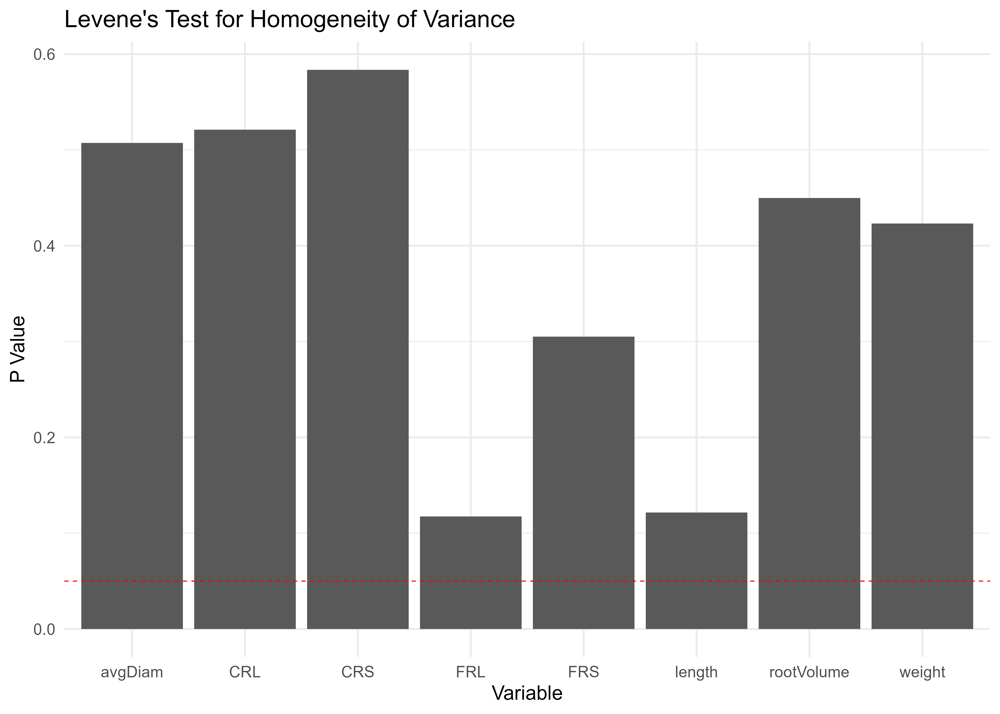

# Introduction

This paper presents the process of analyzing the results of a survey of chestnut seedlings. In particular, the plants were inoculated with two different *Phytophthora* species, *P. cinnamomi* and *P. cambivora*, leaving one control thesis without pathogen inoculation. In each of the three theses inoculated or not, treatments with five different products were tested, leaving one control thesis without treatment.FF

The different treatments are as follows:

|     | Treatment name | Description                         |
|-----|----------------|-------------------------------------|
| 1   | BV             | *Bacillus sp.* 1                    |
| 2   | BV + F35       | *Bacillus sp.* 1 + *Bacillus sp.* 2 |
| 3   | F35            | *Bacillus sp.* 2                    |
| 4   | Kalex          | Potassium phosphate                 |
| 5   | Ridomil        | Anti-peronosporic                   |
| 6   | Control        | Control thesis without              |

The root proprieties are statistically analyzed to select the best product for each treatment in order to use it in field application inside the LIFE Fagesos project. The roots parameters investigated are:

| Parameter name | Description               |
|----------------|---------------------------|
| length         | Total Roots Length        |
| avgDiam        | Total Roots mean diameter |
| rootVolume     | Total Roots Volume        |
| FRL            | Fine Roots Length         |
| CRL            | Coarse Roots Length       |
| FRS            | Fine Roots Surface        |
| CRS            | Coarse Roots Surface      |
| FVOL           | Fine Roots Volume         |
| weight         | Fine Roots weight         |

------------------------------------------------------------------------

Furthermore a leaf symptom analysis is carried out

# Load the packages

```{r, warning=FALSE, message=FALSE}
# Load the necessary packages
library(readxl)
library(dplyr)
library(stringr)
library(readr)
library(ggplot2)
library(gridExtra)
library(cowplot)
library(heplots)
library(FactoMineR)
library(factoextra)
library(Factoshiny)
library(kableExtra)
library(DT)
```

# Symptom analysis

```{r, eval = FALSE}
# Load the symptom assessment sheets datased 
dataframe <- read_delim("G:/Altri computer/Il_mio_computer/DOTTORATO/PROGETTI/FAGESOS_MONTE ARCOSU/SCRIPT_R/Treatment_Castanea/Symptom_assessment/Symptom_assessment_modified.csv", delim = ";")
```

```{r, eval = FALSE}
# Transform dataframe from wide to long
df_long <- tidyr::pivot_longer(dataframe, 
                               cols = starts_with("16/06/2023"):starts_with("21/09/2023"),
                               names_to = "Date",
                               values_to = "Class")

# Convert Date column to date format
df_long$Date <- as.Date(df_long$Date, format = "%d/%m/%Y")

# Convert dates to number of days
df_long$Days <- as.numeric(df_long$Date - min(df_long$Date))

# Calculates the average of Class for each combination of Inoculum, Treatment and Days
df_summary <- df_long %>%
  group_by(Inoculum, Treatment, Days) %>%
  summarize(mean_class = mean(Class)) %>%
  ungroup()

# Write the summary dataframe in a CSV file
write_csv(df_summary, "G:/Altri computer/Il_mio_computer/DOTTORATO/PROGETTI/FAGESOS_MONTE ARCOSU/SCRIPT_R/Treatment_Castanea/Symptom_assessment/DATAFRAME/df_summary_modified.csv")
```

```{r, include= FALSE}
# Clean the R enviroment
rm(list=ls())
```

```{r, message=FALSE, warning=FALSE}
# Load the df summary previously created
df_summary <- read_csv("G:/Altri computer/Il_mio_computer/DOTTORATO/PROGETTI/FAGESOS_MONTE ARCOSU/SCRIPT_R/Treatment_Castanea/Symptom_assessment/DATAFRAME/df_summary_modified.csv")

# Extract from df_summary the values that have a Days<=82 and eilimate the records with Treatment = Ridomil
df_filtered2 <- df_summary[df_summary$Days <= 82 & df_summary$Treatment != "Ridomil", ]

# Create a list of unique inoculations and treatments
inocula <- unique(df_filtered2$Inoculum)
trattamenti <- unique(df_filtered2$Treatment)
```

```{r, warning=FALSE, message=FALSE}
# View the Symptom assessment Table 
datatable(df_filtered2, 
          caption = "Symptom assessment Table", 
          filter = 'top',
          options = list(scrollX = TRUE, scrollY = TRUE),
          class = "display",
          style = "bootstrap")
```

```{r, eval=FALSE}
# Create a list of graphs, one for each inoculum
plots <- lapply(unique(df_filtered2$Inoculum), function(inoculum) {
  # Filter the dataframe for the current inoculum
  df_inoculum <- df_filtered2[df_filtered2$Inoculum == inoculum,]
  
  # Create the graph
  p <- ggplot(df_inoculum, aes(x = Days, y = mean_class, color = Treatment)) +
    geom_step(linewidth = 1) + # if I enter geom_line() / geom_step(), the lines are not square
    labs(title = paste("Inoculum:", inoculum),
         x = "Days",
         y = "Mean Class") +
    ylim(0, 4)
  
  return(p)
})

# Create a grid layout with graphics
grid_plot <- do.call(gridExtra::grid.arrange, c(plots, ncol = 2))

# Save grid layout as PNG file
ggsave("G:/Altri computer/Il_mio_computer/DOTTORATO/PROGETTI/FAGESOS_MONTE ARCOSU/SCRIPT_R/Treatment_Castanea/Symptom_assessment/GRAFICI/MODIFICHE/mean_class_graph1.png", grid_plot, width = 16, height = 12, dpi = 700)
```


```{r}
# Ripulisci l'enviroment di R
rm(list=ls())
```

------------------------------------------------------------------------

# Roots analysis

## Get the data set

In this section, the data set is loaded into R and file preparation begins.

```{r, eval=FALSE}
# Get the name of the file xlxs inside the folder
file_names <- list.files(path = "G:/Altri computer/Il_mio_computer/DOTTORATO/PROGETTI/FAGESOS_MONTE ARCOSU/SCRIPT_R/Treatment_Castanea/Data", pattern = "\\.xlsx$")

# Inizialize a new empty data frame
combined_df <- data.frame()

# Read each file and add it in a new dataframe
for (file in file_names) {
  temp_df <- readxl::read_excel(paste("G:/Altri computer/Il_mio_computer/DOTTORATO/PROGETTI/FAGESOS_MONTE ARCOSU/SCRIPT_R/Treatment_Castanea/Data", file, sep = "/"), sheet = "Global")
  combined_df <- rbind(combined_df, temp_df)
}
```

```{r, eval=FALSE}
# Extract the Treatment column from the "Sanmple id" column and create a new "Treatment" column
# Estrai il Treatment dalla colonna Sample id, e crea la nuova colonna treatment
combined_df$treatment <- sapply(strsplit(combined_df$`Sample Id`, "_"), '[', 3)

# Mobe th "Treatment" column to the second place
combined_df <- combined_df %>%
  select(`Sample Id`, treatment, inoculum, everything())

# Extract the "inoculum column" from the "Sample id" column and create a new "inoculum" column.
combined_df <- combined_df %>%
  mutate(inoculum = str_extract(`Sample Id`, "(?<=_)[^_]+(?=_)"))

# Move the "inoculum" column to the 3° place
combined_df <- combined_df %>%
  select(treatment, inoculum, everything())
```

```{r, eval=FALSE}
# Store the dataframe in csv format
write.csv(combined_df, "G:/Altri computer/Il_mio_computer/DOTTORATO/PROGETTI/FAGESOS_MONTE ARCOSU/SCRIPT_R/Treatment_Castanea/DATAFRAMES/combined_df.csv", append = FALSE)
```

```{r, include=FALSE}
combined_df <- read_csv("G:/Altri computer/Il_mio_computer/DOTTORATO/PROGETTI/FAGESOS_MONTE ARCOSU/SCRIPT_R/Treatment_Castanea/DATAFRAMES/combined_df.csv")

combined_df$...1 <- NULL
combined_df$...56 <- NULL
```

```{r, warning=FALSE, message=FALSE}
# View  the dataset Table 
datatable(combined_df, 
          caption = "Dataset Table", 
          filter = 'top',
          options = list(scrollX = TRUE, scrollY = TRUE,  scrollCollapse = TRUE),
          class = "display",
          style = "bootstrap")
```

```{r, eval=FALSE}

# Ripulisci l'enviroment di R
rm(list=ls())
```

------------------------------------------------------------------------

## Select the columns

In this section all the column necessary to the analysis are selected from the data set.

```{r, eval = FALSE}
# Load the combined data set previosly stored
combined_df <- read_csv("G:/Altri computer/Il_mio_computer/DOTTORATO/PROGETTI/FAGESOS_MONTE ARCOSU/SCRIPT_R/Treatment_Castanea/DATAFRAMES/combined_df.csv")

# Delete undesired column $...1
combined_df$...1 <- NULL
```

```{r, eval = FALSE}
# Select the necessary columns of the roots parameters
cols_fine_roots_lenght <- combined_df %>%
  select(1:4, 67:70)

cols_fine_roots_lenght <- cols_fine_roots_lenght %>%
  mutate(FRL = rowSums(select(., 5:8)))

cols_coarse_roots_lenght <- combined_df %>%
  select(1:4, 71:76)

cols_coarse_roots_lenght <- cols_coarse_roots_lenght %>%
  mutate(CRL = rowSums(select(., 5:8)))

cols_fine_roots_SA <- combined_df %>%
  select(1:4, 78:81)

cols_fine_roots_SA <- cols_fine_roots_SA %>%
  mutate( FRS = rowSums(select(., 5:8)))

cols_coarse_roots_SA <- combined_df %>%
  select(1:4, 82:87)

cols_coarse_roots_SA <- cols_coarse_roots_SA %>%
  mutate(CRS = rowSums(select(., 5:8)))

cols_fine_roots_VOL <- combined_df %>%
  select(1:4, 110:113)

cols_fine_roots_VOL <- cols_fine_roots_VOL %>%
  mutate(FVOL = rowSums(select(., 5:8)))

# Add the coulumn "FRL" to combined_df
combined_df <- left_join(combined_df, cols_fine_roots_lenght %>% select(treatment, inoculum, `Sample Id`, Plant, FRL), by = c("treatment", "inoculum", "Sample Id", "Plant"))

# Add the coulumn "CRL" to combined_df
combined_df <- left_join(combined_df, cols_coarse_roots_lenght %>% select(treatment, inoculum, `Sample Id`, Plant, CRL), by = c("treatment", "inoculum", "Sample Id", "Plant"))

# Add the coulumn "FRS" to combined_df
combined_df <- left_join(combined_df, cols_fine_roots_SA %>% select(treatment, inoculum, `Sample Id`, Plant, FRS), by = c("treatment", "inoculum", "Sample Id", "Plant"))

# Add the coulumn "CRS" to combined_df
combined_df <- left_join(combined_df, cols_coarse_roots_SA %>% select(treatment, inoculum, `Sample Id`, Plant, CRS), by = c("treatment", "inoculum", "Sample Id", "Plant"))

# Add the coulumn "FVOL" to combined_df
combined_df <- left_join(combined_df, cols_fine_roots_VOL %>% select(treatment, inoculum, `Sample Id`, Plant, FVOL), by = c("treatment", "inoculum", "Sample Id", "Plant"))
```

```{r, eval=FALSE}
# Select only the columns number 1:4, 19, 25, 29, 33, 32, 34, 27, 126, 127, 128, 129, 130
selected_columns <- combined_df %>%
  select(1:4, 19, 25, 29, 33, 32, 34, 27, 126, 127, 128, 129, 130)

# Assing the new names to the columns
colnames(selected_columns) <- c("treatment", "inoculum", "sample_Id", "plant", "length", "avgDiam", "rootVolume", "lenPerVol", "tips", "forks", "crossings", "FRL", "CRL", "FRS", "CRS", "FVOL")

# Check if the columns have a new names 
colnames(selected_columns)
```

```{r, eval=FALSE}
# Store the selected_columns data frame in csv format
write.csv(selected_columns, "G:/Altri computer/Il_mio_computer/DOTTORATO/PROGETTI/FAGESOS_MONTE ARCOSU/SCRIPT_R/Treatment_Castanea/DATAFRAMES/selected_columns.csv", append = FALSE)
```

```{r, include = FALSE, message=FALSE, warning=FALSE}
selected_columns <- read_csv("G:/Altri computer/Il_mio_computer/DOTTORATO/PROGETTI/FAGESOS_MONTE ARCOSU/SCRIPT_R/Treatment_Castanea/DATAFRAMES/selected_columns.csv") 

# Delete undesired column $...1
selected_columns$...1 <- NULL
```

```{r, warning=FALSE, message=FALSE}
# View the dataset Table 
datatable(selected_columns, 
          caption = "selected_columns Table", 
          filter = 'top',
          options = list(scrollX = TRUE, scrollY = TRUE),
          class = "display",
          style = "bootstrap")
```

```{r}
# Clear the R enviroment 
rm(list=ls())
```

------------------------------------------------------------------------

## Create a new results Data Frame

In this section a new results data frame is created by grouping the data by plant, inoculum and treatment and summarize the roots parameters.

```{r, eval=FALSE}
# Load the selected_columns data frame stored previously
selected_columns <- read_csv("G:/Altri computer/Il_mio_computer/DOTTORATO/PROGETTI/FAGESOS_MONTE ARCOSU/SCRIPT_R/Treatment_Castanea/DATAFRAMES/selected_columns.csv")

# Delete undesired column $...1
selected_columns$...1 <- NULL
```

```{r, eval=FALSE}
# Create the result_df dataframe with the new summary columns per sampleresult_df <- selected_columns %>%
  group_by(plant, inoculum, treatment) %>%
  summarise(
    length = sum(length),
    avgDiam = mean(avgDiam),
    rootVolume = sum(rootVolume),
    tips = sum(tips),
    forks = sum(forks),
    crossings = sum(crossings),
    FRL = sum(FRL),
    CRL = sum(CRL),
    FRS = sum(FRS),
    CRS = sum(CRS),
    FVOL = sum(FVOL)
  )

# Convert values from cm/m3 to cm/cm3 for column LenPerVolresult_df <- result_df %>%
mutate(lenPerVol = (length / 0.000931) / 1000000)

# Convert the 'plant' column to characters (strings)
result_df$plant <- as.character(result_df$plant)
```

```{r, eval=FALSE}
# Save the result_df dataframe in csv format
write.csv(result_df, "G:/Altri computer/Il_mio_computer/DOTTORATO/PROGETTI/FAGESOS_MONTE ARCOSU/SCRIPT_R/Treatment_Castanea/DATAFRAMES/result_df.csv", append = FALSE)
```

```{r, include = FALSE}
# Load the new resuls df
result_df <- read_csv("G:/Altri computer/Il_mio_computer/DOTTORATO/PROGETTI/FAGESOS_MONTE ARCOSU/SCRIPT_R/Treatment_Castanea/DATAFRAMES/result_df.csv")

# Elimina la colonna indesiderata $...1
result_df$...1 <- NULL
```

```{r, warning=FALSE, message=FALSE}
# View the result_df Table 
datatable(result_df, 
          caption = "Results Table", 
          filter = 'top',
          options = list(scrollX = TRUE, scrollY = TRUE),
          class = "display",
          style = "bootstrap")
```

```{r}
# Clean the R enviroment
rm(list=ls())
```

------------------------------------------------------------------------

## Preparing weight data

In this section the weight data of the fine roots are merged with the roots parameters dataframe.

```{r, eval=FALSE}
# Load the results data frame saved previously
result_df <- read_csv("G:/Altri computer/Il_mio_computer/DOTTORATO/PROGETTI/FAGESOS_MONTE ARCOSU/SCRIPT_R/Treatment_Castanea/DATAFRAMES/result_df.csv")

# Delete undesired column $...1
result_df$...1 <- NULL
```

```{r, eval=FALSE}
# Load the fine roots weight xlxs file
weight <- read_excel("G:/Altri computer/Il_mio_computer/DOTTORATO/PROGETTI/FAGESOS_MONTE ARCOSU/SCRIPT_R/Treatment_Castanea/DATAFRAMES/weight.xlsX")

# Merge the two data frame
new_df <- merge(result_df, weight, by = c("plant", "inoculum", "treatment"))

# Save the new_df dataframe in csv format
write.csv(new_df, "G:/Altri computer/Il_mio_computer/DOTTORATO/PROGETTI/FAGESOS_MONTE ARCOSU/SCRIPT_R/Treatment_Castanea/DATAFRAMES/result_df_weight.csv", append = FALSE)
```

```{r, include=FALSE}
new_df <- read_csv("G:/Altri computer/Il_mio_computer/DOTTORATO/PROGETTI/FAGESOS_MONTE ARCOSU/SCRIPT_R/Treatment_Castanea/DATAFRAMES/result_df_weight.csv")

new_df$...1 <- NULL
```

```{r, warning=FALSE, message=FALSE}
# View the new_df Table 
datatable(new_df, 
          caption = "new_df Table", 
          filter = 'top',
          options = list(scrollX = TRUE, scrollY = TRUE),
          class = "display",
          style = "bootstrap")
```

```{r}
# Clean the R enviroment
rm(list=ls())
```

------------------------------------------------------------------------

## Statistical analysis

```{r, message=FALSE, warning=FALSE}
# Load the results data frame saved previously
result_df <- read_csv("G:/Altri computer/Il_mio_computer/DOTTORATO/PROGETTI/FAGESOS_MONTE ARCOSU/SCRIPT_R/Treatment_Castanea/DATAFRAMES/result_df_weight.csv")

# Delete undesired column $...1
result_df$...1 <- NULL
```

### Analysis of correlation between variables

```{r}
# Calculate the correlation matrix
cor_matrix <- cor(result_df[,c("length", "avgDiam", "rootVolume", "lenPerVol", "tips", "crossings", "forks", "FRL", "CRL", "FRS", "CRS", "FVOL", "weight")])

# View the correlation matrix
datatable(cor_matrix, 
          caption = "Correlation matrix", 
          filter = 'top',
          options = list(scrollX = TRUE, scrollY = TRUE),
          class = "display",
          style = "bootstrap")
```

The variables length, lenPerVol and crossings are strongly correlated, so only one of them should be left. I only take **length** into account. The variables tips, crossings, forks are to be deleted as the image analysis was performed on cut roots and their data ar not correct.

```{r, include=FALSE}
# Clean the R environment
rm(list=ls())
```

------------------------------------------------------------------------

### Create the box plots

```{r, include=FALSE}
# Load the results data frame saved previously
result_df <- read_csv("G:/Altri computer/Il_mio_computer/DOTTORATO/PROGETTI/FAGESOS_MONTE ARCOSU/SCRIPT_R/Treatment_Castanea/DATAFRAMES/result_df_weight.csv")

# Delete undesired column $...1
result_df$...1 <- NULL
```

```{r, eval=FALSE}
# Select only the columns useful to the analysis
columns_el <- result_df %>%
  select(1:3, 4:6, 10:14, 16)
```

```{r, eval=FALSE, message=FALSE, warning=FALSE}
# Rearrange the factor levels.
columns_el$treatment <- factor(columns_el$treatment, levels = c("BV", "BV+F35", "F35", "Kalex", "Ridomil", "Control"))

# This is the plot from which I extract the legend.
leg <- ggplot(columns_el, aes(x = treatment, y = length, fill = inoculum)) +
  geom_boxplot() +
  labs(x = "", y = "Length (cm)") +
  theme(axis.text.x = element_text(angle = 45, hjust = 1, size = 10)) +
  guides(fill = guide_legend(ncol = 3, title = "Inoculum"))+
  scale_fill_discrete(labels=c("AB21", "AB1", "Not inoculated"))

# Extract the legend from one of the graphs.
legend <- cowplot::get_legend(leg)

# Create boxplots for each variable without the legend
plot1 <- ggplot(columns_el, aes(x = treatment, y = length, fill = inoculum)) +
  geom_boxplot(show.legend = FALSE) +
  labs(x = "", y = "Total Length (cm)") +
  theme(axis.text.x = element_text(angle = 45, hjust = 1, size = 10))

plot2 <- ggplot(columns_el, aes(x = treatment, y = rootVolume, fill = inoculum)) +
  geom_boxplot(show.legend = FALSE) +
  labs(x = "", y = "Total Roots Volume(cm3)") +
  theme(axis.text.x = element_text(angle = 45, hjust = 1, size = 10))

plot3 <- ggplot(columns_el, aes(x = treatment, y = FRL, fill = inoculum)) +
  geom_boxplot(show.legend = FALSE) +
  labs(x = "", y = "Fine Roots Length (cm)") +
  theme(axis.text.x = element_text(angle = 45, hjust = 1, size = 10))

plot4 <- ggplot(columns_el, aes(x = treatment, y = FRS, fill = inoculum)) +
  geom_boxplot(show.legend = FALSE) +
  labs(x = "Treatments", y = "Fine Roots Surface (cm2)") +
  theme(axis.text.x = element_text(angle = 45, hjust = 1, size = 10))

plot5 <- ggplot(columns_el, aes(x = treatment, y = FVOL, fill = inoculum)) +
  geom_boxplot(show.legend = FALSE) +
  labs(x = "Treatments", y = "Fine Root Volume (cm3)") +
  theme(axis.text.x = element_text(angle = 45, hjust = 1, size = 10))

plot6 <- ggplot(columns_el, aes(x = treatment, y = weight, fill = inoculum)) +
  geom_boxplot(show.legend = FALSE) +
  labs(x = "Treatments", y = "Fine Root weigth (g)") +
  theme(axis.text.x = element_text(angle = 45, hjust = 1, size = 10))

# Remove legend from individual graphs.
plot1 <- plot1 + theme(legend.position = "none")
plot2 <- plot2 + theme(legend.position = "none")
plot3 <- plot3 + theme(legend.position = "none")
plot4 <- plot4 + theme(legend.position = "none")
plot5 <- plot5 + theme(legend.position = "none")
plot6 <- plot6 + theme(legend.position = "none")

# Create a grid with graphs and legend at the bottom.
grid1 <- grid.arrange(plot1, plot2, plot3, plot4, plot5,plot6, ncol = 2, bottom = legend)

# Specifies the path to save
file_path <- "G:/Altri computer/Il_mio_computer/DOTTORATO/PROGETTI/FAGESOS_MONTE ARCOSU/SCRIPT_R/Treatment_Castanea/GRAPHS/box_plots.png"

# Save the grid as a PNG file.
ggsave(file_path, grid1, width = 16, height = 12, dpi = 700)
```


```{r, include=FALSE}
# Clean the R environment
rm(list=ls())
```

------------------------------------------------------------------------

### Compute the outliers

```{r, include=FALSE}
# Load the results data frame saved previously
result_df <- read_csv("G:/Altri computer/Il_mio_computer/DOTTORATO/PROGETTI/FAGESOS_MONTE ARCOSU/SCRIPT_R/Treatment_Castanea/DATAFRAMES/result_df_weight.csv")

# Delete undesired column $...1
result_df$...1 <- NULL
```

```{r, eval=FALSE}
# Create a new dataframe starting from result_df named outlier_df
outlier_df <- result_df

# Delete the unwanted columns
outlier_df$tips <- NULL
outlier_df$forks <- NULL
outlier_df$crossings <- NULL

# Define the function for identify the outlier
outlier <- function(x) {
  IQR <- IQR(x)
  limite_inferiore <- quantile(x, 0.25) - 1.5 * IQR
  limite_superiore <- quantile(x, 0.75) + 1.5 * IQR
  x < limite_inferiore | x > limite_superiore
}

# Apply the outilier function to each group
outlier_df <- outlier_df %>%
  group_by(inoculum, treatment) %>%
  mutate(across(where(is.numeric), list(outlier = outlier)))
```

```{r, eval = FALSE}
library(openxlsx)

# Save the dataframe in xlxs format
write.xlsx(outlier_df, "G:/Altri computer/Il_mio_computer/DOTTORATO/PROGETTI/FAGESOS_MONTE ARCOSU/SCRIPT_R/Treatment_Castanea/Analisi_statistica_risultati/outier.xlsx")
```

```{r, include = FALSE}
# Load the outlier dataframe 
outlier_df <- read_excel("G:/Altri computer/Il_mio_computer/DOTTORATO/PROGETTI/FAGESOS_MONTE ARCOSU/SCRIPT_R/Treatment_Castanea/Analisi_statistica_risultati/outier.xlsx")
```

```{r, warning=FALSE, message=FALSE}
# View the outlier Table 
datatable(outlier_df, 
          caption = "Outlier Table", 
          filter = 'top',
          options = list(scrollX = TRUE, scrollY = TRUE),
          class = "display",
          style = "bootstrap")
```

```{r, include=FALSE}
# Clean the R environment
rm(list=ls())
```

------------------------------------------------------------------------

### Create the bar graph

```{r, include=FALSE}
# Load the results data frame saved previously
result_df <- read_csv("G:/Altri computer/Il_mio_computer/DOTTORATO/PROGETTI/FAGESOS_MONTE ARCOSU/SCRIPT_R/Treatment_Castanea/DATAFRAMES/result_df_weight.csv")

# Delete undesired column $...1
result_df$...1 <- NULL

# Converti la colonna "plant" in caratteri (stringhe)
result_df$plant <- as.character(result_df$plant)
```

```{r, eval=FALSE}
# Calculate the mean and the standard error for each treatment and inoculum
df_summary <- result_df %>%
  group_by(treatment, inoculum) %>%
  summarise(across(c(length, avgDiam, rootVolume, FRL, CRL, FRS, CRS, FVOL, lenPerVol), list(mean = mean, se = ~sd(.x)/sqrt(length(.x))), .names = "{.col}_{.fn}"))

# Riordina i livelli del fattore
df_summary$treatment <- factor(df_summary$treatment, levels = c("BV", "BV+F35", "F35", "Kalex", "Ridomil", "Control"))

# Save the summary dataframe
write.csv(df_summary, "G:/Altri computer/Il_mio_computer/DOTTORATO/PROGETTI/FAGESOS_MONTE ARCOSU/SCRIPT_R/Treatment_Castanea/DATAFRAMES/df_summary.csv")
```

```{r, include = FALSE}
# Load the df_summary
df_summary <- read_csv("G:/Altri computer/Il_mio_computer/DOTTORATO/PROGETTI/FAGESOS_MONTE ARCOSU/SCRIPT_R/Treatment_Castanea/DATAFRAMES/df_summary.csv")
```

```{r, warning=FALSE, message=FALSE}
# View the mean and standard error Table 
datatable(df_summary, 
          caption = "Mean and standard error Table", 
          filter = 'top',
          options = list(scrollX = TRUE, scrollY = TRUE),
          class = "display",
          style = "bootstrap")
```

```{r,eval=FALSE}
# Create the bar graph with the standard error
p1 <- ggplot(df_summary, aes(x=treatment, y= length_mean, fill=inoculum)) +
  geom_bar(stat="identity", position=position_dodge(), colour="black") +
  geom_errorbar(aes(ymin=length_mean - length_se, ymax=length_mean + length_se), 
                width=.2, position=position_dodge(.9)) +
  labs(x="Treatment", y=paste("Length (cm)")) +
  theme(axis.text.x = element_text(angle = 45, hjust = 1, size = 10)) +
  theme_minimal() +
  guides(fill = guide_legend(ncol = 3, title = "Inoculum"))+
  scale_fill_discrete(labels=c("AB21", "AB1","Not inoculated"))

p2 <- ggplot(df_summary, aes(x=treatment, y= avgDiam_mean, fill=inoculum)) +
  geom_bar(stat="identity", position=position_dodge(), colour="black") +
  geom_errorbar(aes(ymin=avgDiam_mean - avgDiam_se, ymax=avgDiam_mean + avgDiam_se), 
                width=.2, position=position_dodge(.9)) +
  labs(x="Treatment", y=paste("AvgDiam(mm)")) +
  theme(axis.text.x = element_text(angle = 45, hjust = 1, size = 10)) +
  theme_minimal() +
  guides(fill = guide_legend(ncol = 3, title = "Inoculum"))+
  scale_fill_discrete(labels=c("AB21", "AB1", "Not inoculated"))

p3 <- ggplot(df_summary, aes(x=treatment, y= rootVolume_mean, fill=inoculum)) +
  geom_bar(stat="identity", position=position_dodge(), colour="black") +
  geom_errorbar(aes(ymin=rootVolume_mean - rootVolume_se, ymax=rootVolume_mean + rootVolume_se), 
                width=.2, position=position_dodge(.9)) +
  labs(x="Treatment", y=paste("Total Roots Volume(cm3)")) +
  theme(axis.text.x = element_text(angle = 45, hjust = 1, size = 10)) +
  theme_minimal() +
  guides(fill = guide_legend(ncol = 3, title = "Inoculum"))+
  scale_fill_discrete(labels=c("AB21", "AB1", "Not inoculated"))

p4 <- ggplot(df_summary, aes(x=treatment, y= FRL_mean, fill=inoculum)) +
  geom_bar(stat="identity", position=position_dodge(), colour="black") +
  geom_errorbar(aes(ymin=FRL_mean - FRL_se, ymax=FRL_mean + FRL_se), 
                width=.2, position=position_dodge(.9)) +
  labs(x="Treatment", y=paste("Fine Roots Length (cm)")) +
  theme(axis.text.x = element_text(angle = 45, hjust = 1, size = 10)) +
  theme_minimal() +
  guides(fill = guide_legend(ncol = 3, title = "Inoculum"))+
  scale_fill_discrete(labels=c("AB21", "AB1", "Not inoculated"))

p5 <- ggplot(df_summary, aes(x=treatment, y= FRS_mean, fill=inoculum)) +
  geom_bar(stat="identity", position=position_dodge(), colour="black") +
  geom_errorbar(aes(ymin=FRS_mean - FRS_se, ymax=FRS_mean + FRS_se), 
                width=.2, position=position_dodge(.9)) +
  labs(x="Treatment", y=paste("Fine Roots Surface (cm2)")) +
  theme(axis.text.x = element_text(angle = 45, hjust = 1, size = 10)) +
  theme_minimal() +
  guides(fill = guide_legend(ncol = 3, title = "Inoculum"))+
  scale_fill_discrete(labels=c("AB21", "AB1", "Not inoculated"))

p6 <- ggplot(df_summary, aes(x=treatment, y= FVOL_mean, fill=inoculum)) +
  geom_bar(stat="identity", position=position_dodge(), colour="black") +
  geom_errorbar(aes(ymin=FVOL_mean - FVOL_se, ymax=FVOL_mean + FVOL_se), 
                width=.2, position=position_dodge(.9)) +
  labs(x="Treatment", y=paste("Fine Roots Volume")) +
  theme(axis.text.x = element_text(angle = 45, hjust = 1, size = 10)) +
  theme_minimal() +
  guides(fill = guide_legend(ncol = 3, title = "Inoculum"))+
  scale_fill_discrete(labels=c("AB21", "AB1", "Not inoculated"))

# Extract the legend from one of the graphs
legend2 <- cowplot::get_legend(p1)

# Delete the legend from the other plots
p1 <- p1 + theme(legend.position = "none")
p2 <- p2 + theme(legend.position = "none")
p3 <- p3 + theme(legend.position = "none")
p4 <- p4 + theme(legend.position = "none")
p5 <- p5 + theme(legend.position = "none")
p6 <- p6 + theme(legend.position = "none")

# Create a grid with graphs and legend at the bottom
grid2 <- grid.arrange(p1, p2, p3, p4, p5, p6, ncol = 3, bottom = legend2)

# Specifies the path for saving
file_path <- "G:/Altri computer/Il_mio_computer/DOTTORATO/PROGETTI/FAGESOS_MONTE ARCOSU/SCRIPT_R/Treatment_Castanea/GRAPHS/hists_SE.png"

# Save the grid as a PNG file
ggsave(file_path, grid2, width = 16, height = 12, dpi = 700)
```


```{r, include=FALSE}
# Clean the R environment
rm(list=ls())
```

------------------------------------------------------------------------

### Statistical Test

```{r, message=FALSE, warning=FALSE}
# Carica il df result_df salvato precedentemente
result_df <- read_csv("G:/Altri computer/Il_mio_computer/DOTTORATO/PROGETTI/FAGESOS_MONTE ARCOSU/SCRIPT_R/Treatment_Castanea/DATAFRAMES/result_df_weight.csv")

# Elimina la colonna indesiderata $...1
result_df$...1 <- NULL

# Converti la colonna "plant" in caratteri (stringhe)
result_df$plant <- as.character(result_df$plant)

# Crea un nuovo dataframe uguale al precedente
df <- result_df

# df$lenPerVol <- NULL

df$crossings <- NULL

df$tips <- NULL

df$forks <- NULL

# Trasformazione della variabile treatment e inoculum in fattore
df$treatment <- as.factor(df$treatment)
df$inoculum <- as.factor(df$inoculum)
```

#### Check ANOVA assumptions

##### Levene's Test

```{r, eval=FALSE}
# Load the necessary packages
library(dplyr)
library(car)
```

```{r, eval=FALSE}
# Inizializza un dataframe vuoto per memorizzare i risultati
results <- data.frame(var = character(), p.value = numeric())

# Elenco delle variabili numeriche nel dataframe
vars <- c("length", "avgDiam", "rootVolume", "FRL", "CRL", "FRS", "CRS", "weight")

# Esegui il test di Levene per ogni variabile e salva i risultati
for (var in vars) {
  df$group <- interaction(df$inoculum, df$treatment)
  formula <- as.formula(paste(var, "~ group"))
  test <- leveneTest(formula, data = df)
  results <- rbind(results, data.frame(var = var, p.value = test[1, "Pr(>F)"]))
}

# Crea un grafico a barre dei risultati del test di Levene con linea orizzontale a y = 0.05
levene_plot <- ggplot(results, aes(x = var, y = p.value)) +
  geom_bar(stat = "identity") +
  theme_minimal(base_size = 20) +
  labs(x = "Variable", y = "P Value", title = "Levene's Test for Homogeneity of Variance") +
  geom_hline(yintercept = 0.05, linetype = "dashed", color = "red")

# Specifies the path to save
file_path <- "G:/Altri computer/Il_mio_computer/DOTTORATO/PROGETTI/FAGESOS_MONTE ARCOSU/SCRIPT_R/Treatment_Castanea/GRAPHS/levene_Test_plot.png"

# Save the grid as a PNG file.
ggsave(file_path, levene_plot, width = 14, height = 10, dpi = 300)

# Write the results in a csv file
write.csv(results, file = "G:/Altri computer/Il_mio_computer/DOTTORATO/PROGETTI/FAGESOS_MONTE ARCOSU/SCRIPT_R/Treatment_Castanea/DATAFRAMES/levene_test_results.csv")
```



```{r, include=FALSE}
# Load the csv file of the Levene's Test results
results <- read_csv("G:/Altri computer/Il_mio_computer/DOTTORATO/PROGETTI/FAGESOS_MONTE ARCOSU/SCRIPT_R/Treatment_Castanea/DATAFRAMES/levene_test_results.csv")

# Delete the column "...1"
results$...1 <- NULL
```

```{r, warning=FALSE, message=FALSE}
# View the Levene's Test for Homogeneity of Variance data frame
datatable(results, 
          caption = "Levene's Test for Homogeneity of Variance", 
          filter = 'top',
          options = list(scrollX = TRUE, scrollY = TRUE),
          class = "display",
          style = "bootstrap")
```

The results of Levene's Test allow us to accept the null hypothesis of homogeneity of variances. there is insufficient evidence to reject the hypothesis that the variances in the different groups are equal.

##### Shapiro-Wilk Test for Normality

```{r}
# Inizializza un dataframe vuoto per memorizzare i risultati
shapiro_results <- data.frame(var = character(), p.value = numeric())

# Elenco delle variabili numeriche nel dataframe
vars <- c("length", "avgDiam", "rootVolume", "FRL", "CRL", "FRS", "CRS", "weight")

# Esegui il test di Shapiro-Wilk per ogni variabile e salva i risultati
for (var in vars) {
  model <- lm(df[[var]] ~ 1)  # Addestra il modello con intercept
  residuals_model <- residuals(model)
  test <- shapiro.test(residuals_model)
  shapiro_results <- rbind(shapiro_results, data.frame(var = var, p.value = test$p.value))
}

# Crea un grafico a barre dei risultati del test di Levene
shapiro_plot <- ggplot(shapiro_results, aes(x = var, y = p.value)) +
  geom_bar(stat = "identity") +
  theme_minimal(base_size = 20) +
  labs(x = "Variable", y = "P Value", title = "Shapiro-wilk Test for data normality")

# Specifies the path to save
file_path <- "G:/Altri computer/Il_mio_computer/DOTTORATO/PROGETTI/FAGESOS_MONTE ARCOSU/SCRIPT_R/Treatment_Castanea/GRAPHS/Shapiro_Test_plot.png"

# Save the grid as a PNG file.
ggsave(file_path, shapiro_plot, width = 14, height = 10, dpi = 300)

shapiro_plot

# Write the shapiro_results in a csv file
write.csv(shapiro_results, file = "G:/Altri computer/Il_mio_computer/DOTTORATO/PROGETTI/FAGESOS_MONTE ARCOSU/SCRIPT_R/Treatment_Castanea/DATAFRAMES/levene_test_results.csv")
```

```{r, include=FALSE}
shapiro_results <- read_csv("G:/Altri computer/Il_mio_computer/DOTTORATO/PROGETTI/FAGESOS_MONTE ARCOSU/SCRIPT_R/Treatment_Castanea/DATAFRAMES/shapiro_results.csv")
```

```{r, warning=FALSE, message=FALSE}
# View the Shapiro-Wilk Test for normality
datatable(shapiro_results, 
          caption = "Shapiro-Wilk Results Test", 
          filter = 'top',
          options = list(scrollX = TRUE, scrollY = TRUE),
          class = "display",
          style = "bootstrap")
```

```{r, eval=FALSE}
vars <- c("length", "avgDiam", "rootVolume", "FRL", "CRL", "FRS", "CRS", "weight")

# Crea ggqqplot per ogni variabile e raggruppa per inoculum
qqplots_1_list <- list()

for (var in vars) {
  # Creazione del ggqqplot per ogni variabile e raggruppato per inoculum
  ggqq <- ggplot(df, aes(sample = df[[var]])) +
    geom_qq() +
    geom_qq_line() +
    labs(title = paste("Q-Q Plot for", var)) +
    facet_wrap(~inoculum)  # Aggiungi il raggruppamento per inoculum
  
  # Aggiungi il ggqqplot alla lista dei grafici
  qqplots_1_list[[var]] <- ggqq
}

# Creazione di un grafico per ogni variabile e per ogni "inoculum" su Grid arrange
qqplots_1 <- grid.arrange(grobs = qqplots_1_list, ncol = 2)  # Puoi impostare il numero di colonne desiderato

# Specifies the path to save
file_path <- "G:/Altri computer/Il_mio_computer/DOTTORATO/PROGETTI/FAGESOS_MONTE ARCOSU/SCRIPT_R/Treatment_Castanea/GRAPHS/qqpolot_1.png"

# Save the grid as a PNG file.
ggsave(file_path, qqplots_1, width = 16, height = 12, dpi = 700)

###########

# Your existing code for creating Q-Q plots
vars <- c("length", "avgDiam", "rootVolume", "FRL", "CRL", "FRS", "CRS", "weight")

qqplots_list <- list()

for (var in vars) {
  ggqq <- ggplot(df, aes(sample = df[[var]])) +
    geom_qq() +
    geom_qq_line(col = "red") +
    labs(title = paste("Q-Q Plot for", var))
  
  qqplots_list[[var]] <- ggqq
}

# Adjusted layout parameters for equal plots
qqplots <- grid.arrange(grobs = qqplots_list, ncol = 4, nrow = 2)

# Specifies the path to save
file_path <- "G:/Altri computer/Il_mio_computer/DOTTORATO/PROGETTI/FAGESOS_MONTE ARCOSU/SCRIPT_R/Treatment_Castanea/GRAPHS/qqpolot_2.png"

# Save the grid as a PNG file.
ggsave(file_path, qqplots_2, width = 16, height = 12, dpi = 700)

```


#### Anova Tests

In this section a ANOVA test is carried out for each variable

```{r}
# Carica il df result_df salvato precedentemente
result_df <- read_csv("G:/Altri computer/Il_mio_computer/DOTTORATO/PROGETTI/FAGESOS_MONTE ARCOSU/SCRIPT_R/Treatment_Castanea/DATAFRAMES/result_df_weight.csv")

# Elimina le colonne indesiderate
result_df <- subset(result_df, select = -c(...1, tips, forks, crossings, lenPerVol))

# Converti la colonna "plant" in caratteri (stringhe)
result_df$plant <- as.character(result_df$plant)

result_df$inoculum <- as.factor(result_df$inoculum)

# Aggiungi una colonna con le combinzioni
result_df$comb<- paste(result_df$inoculum, result_df$treatment, sep = "_")

# Sposta la colononna comb al4° posto
result_df <- result_df[, c("plant", "inoculum", "treatment", "comb", "length", "avgDiam", "rootVolume","FRL", "CRL", "FRS", "CRS", "FVOL", "weight")]

# Elenco delle variabili numeriche
num_vars <- c("length", "avgDiam", "rootVolume", "FRL", "CRL", "FRS", "CRS", "FVOL", "weight")

# Imposta l'opzione per visualizzare i valori senza notazione esponenziale
options(scipen = 999)

# Creazione di un dataframe vuoto per la tabella dei risultati
result_table <- data.frame(Inoculum = character(), Variabile = character(), F_value = numeric(), P_value = numeric(), stringsAsFactors = FALSE)

# Loop attraverso le variabili numeriche
for (var in num_vars) {
  # Loop attraverso i livelli di 'inoculum' (assumendo che 'inoculum' sia una colonna nel tuo dataframe)
  for (inoculum_level in unique(result_df$inoculum)) {
    # Filtra il dataframe per il livello corrente di 'inoculum'
    subset_data <- subset(result_df, inoculum == inoculum_level)
    # Stampa il nome della variabile corrente e il livello di 'inoculum'
    cat("Inoculum:", inoculum_level, "\n", "Variabile:", var)
    # Crea la formula per l'ANOVA
    formula <- as.formula(paste(var, "~ treatment"))
    # Esegui l'ANOVA
    anova_result <- aov(formula, data = subset_data)
    # Estrai i valori di F e p
    f_value <- summary(anova_result)[[1]][["F value"]][1]
    p_value <- summary(anova_result)[[1]][["Pr(>F)"]][1]
    # Aggiungi i risultati alla tabella
    result_table <- rbind(result_table, data.frame(Variabile = var, Inoculum = inoculum_level, F_value = f_value, P_value = p_value))
    # Stampa il summary dell'ANOVA
    print(summary(anova_result))
  }
}

# View the ANOVA TEST Table 
datatable(result_table, 
          caption = "ANOVA TEST", 
          filter = 'top',
          options = list(scrollX = TRUE, scrollY = TRUE),
          class = "display",
          style = "bootstrap")
```

#### Permanova

Perform a PERMANOVA test for each inoculum.

```{r}
library(vegan)

set.seed(1234)
# head(df)

ab21<-subset(df,result_df$inoculum=="AB21")

matrix_dist_AB21<-vegdist(ab21[,c(4:11,13)],method="gower")

# nmds<-metaMDS(ab21[,c(4:11,13)],distance="gower")
# plot(nmds,display="sites",  type = "p")

permanova_ab21 <-adonis2(sqrt(matrix_dist_AB21)~ab21$treatment,permutations = 9999)
permanova_ab21
```

```{r}
set.seed(1234)
# head(df)

ab1<-subset(df,result_df$inoculum=="AB1")

matrix_dist_AB1<-vegdist(ab1[,c(4:11,13)],method="gower")

# nmds<-metaMDS(ab21[,c(4:11,13)],distance="gower")
# plot(nmds,display="sites",  type = "p")

permanova_ab1 <-adonis2(sqrt(matrix_dist_AB1)~ab1$treatment,permutations = 9999)
permanova_ab1
```


```{r}
set.seed(1234)
# head(df)

ni <-subset(df,result_df$inoculum=="NI")

matrix_dist_NI<-vegdist(ni[,c(4:11,13)],method="gower")

# nmds<-metaMDS(ab21[,c(4:11,13)],distance="gower")
# plot(nmds,display="sites",  type = "p")

permanova_ni <-adonis2(sqrt(matrix_dist_NI)~ni$treatment,permutations = 9999)
permanova_ni
```


